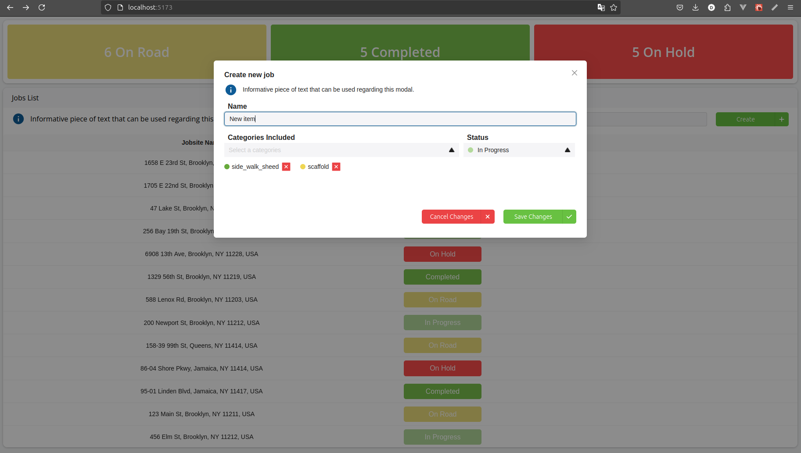
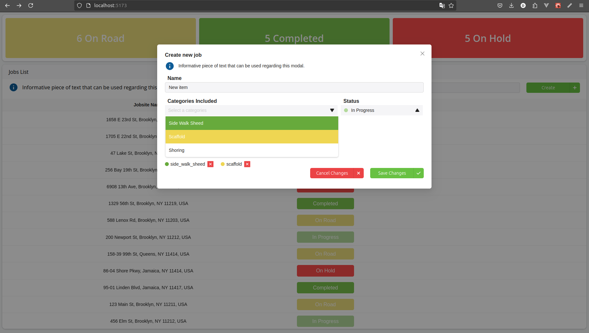

# How to run the application

### 1. npm run install

To install all dependencies

### 2. npm run server

This command will start the server on port <http://localhost:3000/jobs> to mock api using json-server.  
visit the doc for more information: <https://github.com/typicode/json-server/tree/v0>

### 3. npm run dev

### This command will run the client on port <http://localhost:5173/>

## How might you make this app more secure?

#### Input Validation and Sanitization:

Validate and sanitize inputs on both the client and server sides to prevent XSS and injection attacks.

---

## How Would You Make This React App Scale to Millions of Records?

#### Optimized State Management:

Use state management libraries like Redux or Zustand efficiently to handle large datasets without performance hits.

#### Pagination and Infinite Scroll:

Implement pagination or infinite scroll to load data in chunks rather than all at once.
Caching:

Utilize client-side caching with libraries like React Query or SWR to reduce unnecessary API calls.

---

